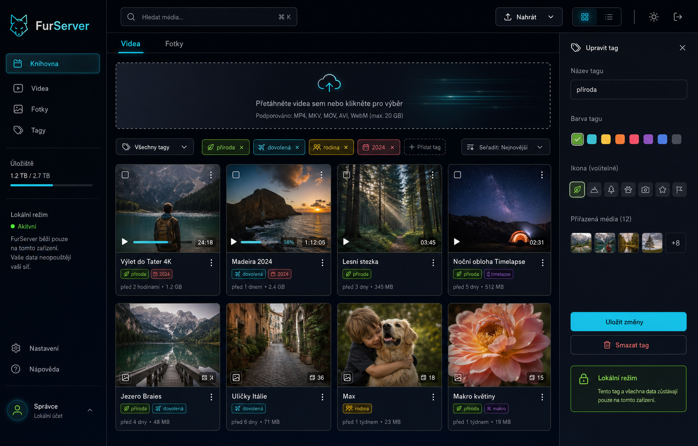

# FurServer

Moderní lokální media vault pro videa, fotky, tagy a soukromé účty ve Flasku.

[Live web na Netlify](https://furserver.netlify.app) · [Netlify projekt](https://app.netlify.com/projects/furserver)



## Co je nové

- Moderní dark UI s animacemi, command barem, responzivním sidebarem a media gridem.
- Lokální registrace a přihlášení přes Flask session.
- Hesla se ukládají jako hash do `data/users.json`.
- Videa i fotky mají tagy, editaci tagů, tag filtry a vyhledávání podle názvu i tagu.
- Upload modal podporuje video/fotku, vlastní název a tagy při nahrání.
- Přejmenování, mazání a chráněné media routy jsou dostupné až po přihlášení.
- Přehrávač videa ukládá progress lokálně do `videos/metadata.json`.
- Samostatný statický web pro Netlify je v `website/`.

## Spuštění lokálně

```bash
git clone https://github.com/hovnokleslo14/furserver.git
cd furserver
pip install -r requirements.txt
python app.py
```

Pak otevři [http://localhost:5000](http://localhost:5000).

Při prvním spuštění se zobrazí registrace hlavního lokálního účtu. Další přístupy už půjdou přes přihlášení.

## Lokální data

FurServer zůstává jednoduchý a lokální:

- `videos/` ukládá videa a `videos/metadata.json`
- `photos/` ukládá fotky a `photos/metadata.json`
- `data/users.json` ukládá lokální účty
- `data/secret.key` drží stabilní Flask session secret

`data/users.json`, `data/secret.key` a nahraná média jsou ignorovaná Gitem, aby se soukromý obsah neposílal do repozitáře.

## Netlify web

Netlify hostuje statickou prezentační stránku z adresáře `website/`:

```toml
[build]
  publish = "website"
```

Produkční URL: [https://furserver.netlify.app](https://furserver.netlify.app)

Samotná Flask aplikace s uploady a lokálním souborovým úložištěm se spouští na tvém zařízení nebo na vlastním Python serveru.

## Struktura

```text
furserver/
├── app.py
├── requirements.txt
├── netlify.toml
├── data/
├── photos/
│   └── metadata.json
├── videos/
│   └── metadata.json
├── static/
│   └── style.css
├── templates/
│   ├── auth.html
│   ├── index.html
│   └── stream.html
└── website/
    ├── index.html
    ├── styles.css
    └── assets/
```

## Podporované formáty

Videa: `mp4`, `webm`, `ogg`, `mkv`

Fotky: `jpg`, `jpeg`, `png`, `gif`, `bmp`, `webp`

## Licence

GPL-3.0
